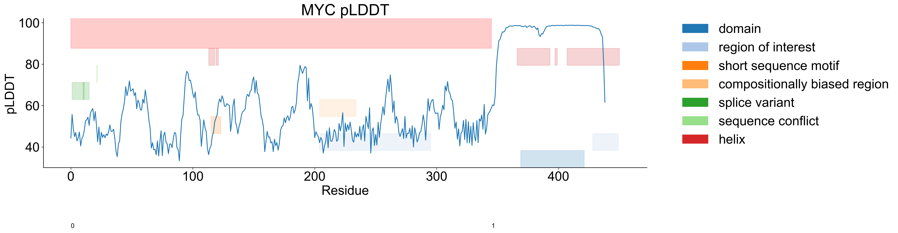

# An insilico microscope of proteins
Proscope is a toolbox for examine proteins, developed by Xi Fu in [Rabadan Lab, Program of Mathematical Genomics, Columbia University](https://www.rabadanlab.org)

## Installation
```bash
mamba create -f environment.yml
# or 
mamba install -c conda-forge -c bioconda matplotlib numpy pandas seaborn biopython tqdm xmlschema scipy nglview py3Dmol
# or
pip install -e .
```
Usage example can be found in test folder.

# Protein domain visualization


# ES Score
To plot ES score for any human reference protein, use this Jupyter notebook.
https://colab.research.google.com/github/fuxialexander/proscope/blob/master/ES_Score.ipynb

